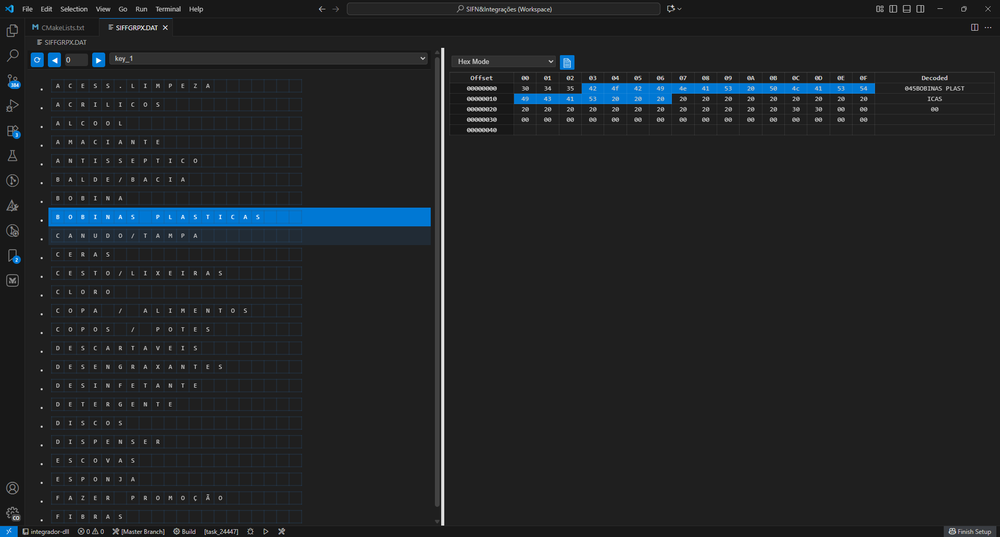
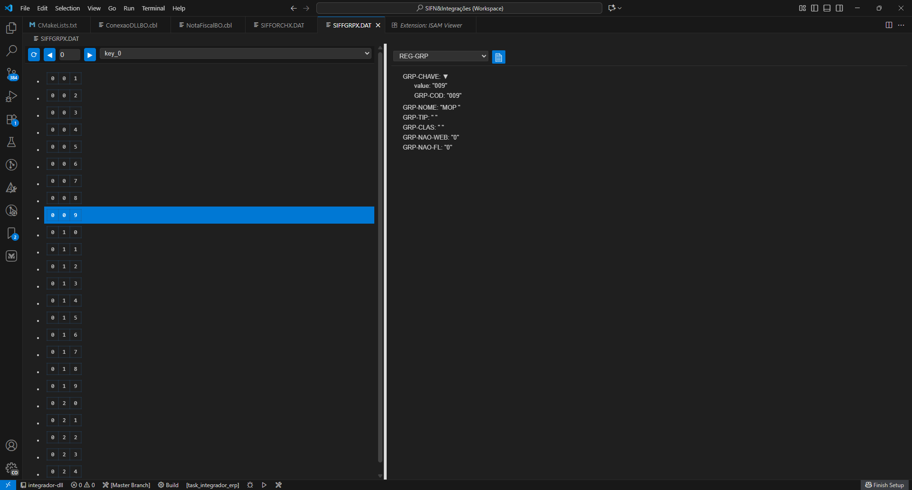

# ISAM Viewer – VS Code Extension

Uma extensão do **Visual Studio Code** que fornece um **Custom Editor** para arquivos **ISAM**, permitindo:

- **Visualização em Hexadecimal**: abra e inspecione o conteúdo bruto em modo hex.
- **Visualização em Árvore**: caso exista um arquivo JSON descrevendo a estrutura do registro, é possível ver os dados em um formato hierárquico amigável.

---

## 📸 Preview



---

## 🛠️ Uso

1. Abra um arquivo **.isam** no VS Code.
2. O ISAM Viewer será uma opção de **Custom Editor**.
3. Por padrão, o conteúdo será exibido em **Hex Mode**.

### Exibição em Árvore

- Crie um arquivo JSON que descreva a estrutura do registro.
- Salve esse arquivo no mesmo diretório do arquivo `.isam`, com o mesmo nome-base.  
  Por exemplo:

- Quando o JSON estiver presente, a extensão mostrará automaticamente uma aba “Árvore” com a representação dos campos.

---

## 🧩 Exemplo de Arquivo de Estrutura (JSON)

```json
{
    "REG-GRP": {
        "picture": "GROUP",
        "offset": "1368",
        "size": "64",
        "child": {
            "GRP-CHAVE": {
                "picture": "PIC9(3)",
                "offset": "1368",
                "size": "3",
                "child":{
                    "GRP-COD": {
                        "picture": "PIC9(3)",
                        "offset": "1368",
                        "size": "3"
                    }   
                }
            },
            "GRP-NOME": {
                "picture": "PICX(20)",
                "offset": "1371",
                "size": "20"
            },
            "GRP-TIP": {
                "picture": "PICX",
                "offset": "1391",
                "size": "1"
            },
            "GRP-CLAS": {
                "picture": "PICX(20)",
                "offset": "1392",
                "size": "20"
            },
            "GRP-NAO-WEB": {
                "picture": "PIC9",
                "offset": "1412",
                "size": "1"
            },
            "GRP-NAO-FL": {
                "picture": "PIC9",
                "offset": "1413",
                "size": "1"
            }
        }
    }
}
```

